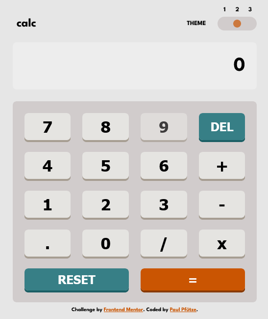

# Frontend Mentor - Calculator app solution

This is a solution to the [Calculator app challenge on Frontend Mentor](https://www.frontendmentor.io/challenges/calculator-app-9lteq5N29). Frontend Mentor challenges help you improve your coding skills by building realistic projects. 

## Table of contents

- [Overview](#overview)
  - [The challenge](#the-challenge)
  - [Screenshot](#screenshot)
  - [Links](#links)
- [My process](#my-process)
  - [Built with](#built-with)
  - [What I learned](#what-i-learned)
  - [Continued development](#continued-development)
  - [Useful resources](#useful-resources)
- [Author](#author)
- [Acknowledgments](#acknowledgments)

**Note: Delete this note and update the table of contents based on what sections you keep.**

## Overview

### The challenge

Users should be able to:

- See the size of the elements adjust based on their device's screen size
- Perform mathmatical operations like addition, subtraction, multiplication, and division
- Adjust the color theme based on their preference
- **Bonus**: Have their initial theme preference checked using `prefers-color-scheme` and have any additional changes saved in the browser

### Screenshot

### Links
**TBD**
- Solution URL: [Add solution URL here](https://your-solution-url.com)
- Live Site URL: [Add live site URL here](https://your-live-site-url.com)

## My process

### Built with

- Semantic HTML5 markup
- CSS custom properties
- Flexbox
- CSS Grid
- [jQuery](https://jquery.com/) - JS library

### What I learned

- some jQuery
- how to listen for keyboard input
- JavaScript eval() and why not to use it
- how to split up files and import functions

### Continued development

- SCSS - once I dived deeper into SCSS I'll nest the themes

## Author

- Frontend Mentor - [@SutonToch](https://www.frontendmentor.io/profile/SutonToch)

## Acknowledgments

- Use double spacebar for reset (Shog9) [Stackoverflow - How to trap double key press in javascript?](https://stackoverflow.com/questions/1223764/how-to-trap-double-key-press-in-javascript)